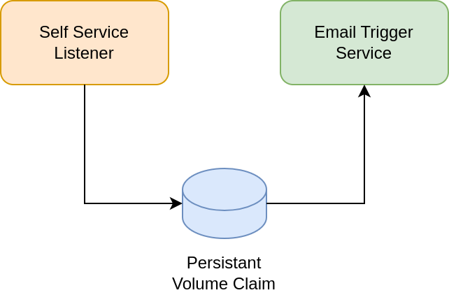

# Self Service Listener

This repository contains the components needed for the user invitation flow. In
this flow, the user receives an email with a link (sent by UMC) and can then
set its own password.

## Components

##### Self Service Listener

This components listens for newly-created users with an LDAP flag to set their
own password. This service then creates a file in the shared filesystem (a
persistant volume).

> Currently based on Univention Directory Listener

##### Email Trigger Service

This component watches the shared directory and triggers the UMC command
`passwordreset/send_token` when the user has `univentionPasswordSelfServiceEmail`
set. Then UMC sends the email to the user.

## Architecture

